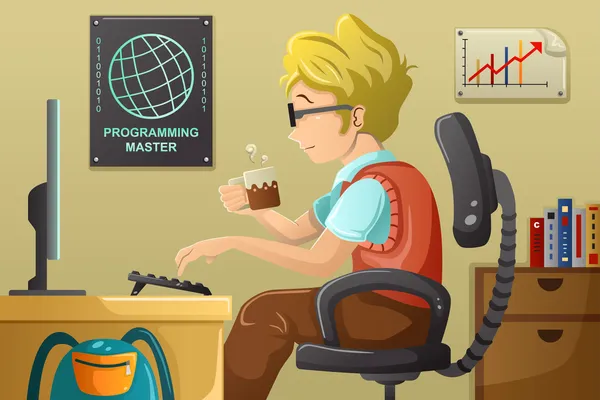

# My first week learning to code! #

## Learning the basics ##

This week has been quite the adjustment for me.  While I love working with computers, I come from a career field that has very little to do with the hidden workings of the web and have had to take extra care that I am understanding all of the concepts taught to us at the **Awesome Inc.** bootcamp.    I have been lucky enough to connect with people at this bootcamp that have been a **huge help** in starting my jounrey as a Developer.

 Due to my lack of experience in the field I didn't have much idea of what to expect.  *Obviously* I knew we would be working on the basics of coding, however the challenges I faced in setting up the work space were a little unexpected. Although my experience with HTML and CSS are limited, I am able to understand the goal of the language and the purpose behind the syntax, it is just a matter of taking the time and working on the repitions, as well as putting myself in uncomfortable positions to learn more about them.  Git, GitHub, GitPod and the CLI are a different story altogether.  I had done some work in VSCode in the past, however syncing that to the GitPod space proved challenging.  My biggest hurdle was understanding the syntax and applying that to the repositories I was working on.
 
 Despite my challenges I am eager to learn more about how these spaces interact and how I can leverage their design to assist me in the future.  The thing I am most excited for is learning how to dress up a web page in my own individual style and truly make something that I can call *my own*.
 
 I hope this blog will allow me to become more familiar these spaces and provide a space of reflection for me to discuss the knowledge I currently have, as well as set goals and track progress.
 
 Follow me as I take the deep dive into the coding world
 ![Guy jumping into the ocean][guy]
 [guy]: img/followme.jpeg
